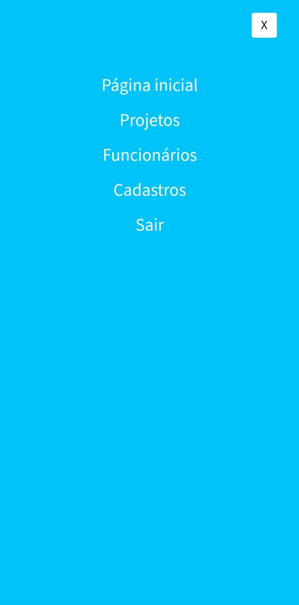
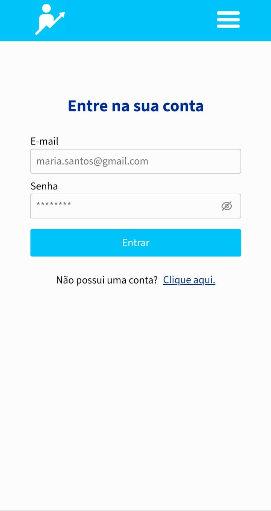
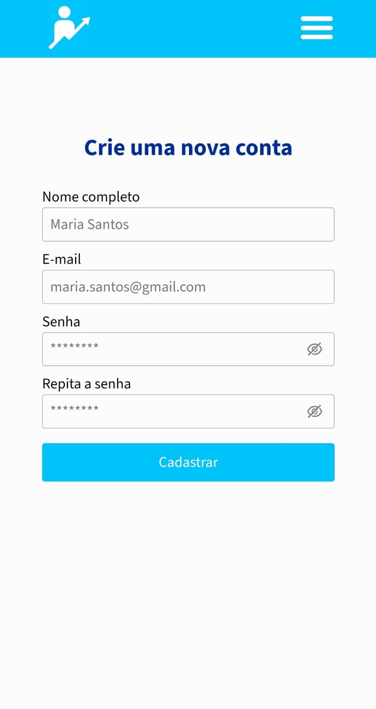
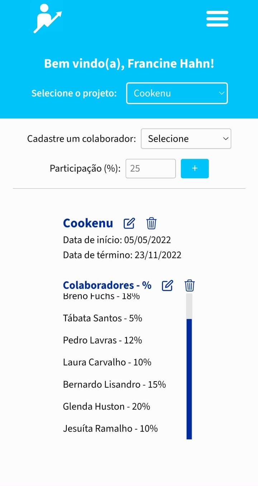
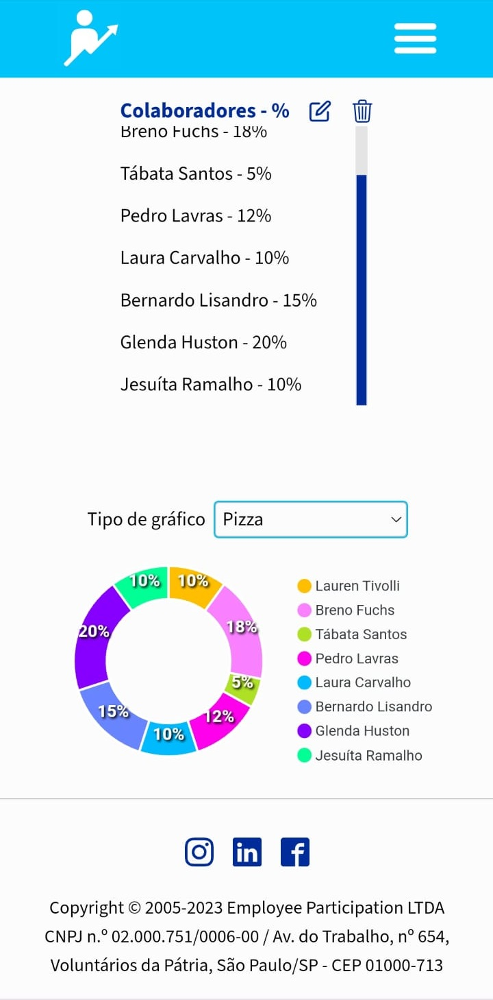
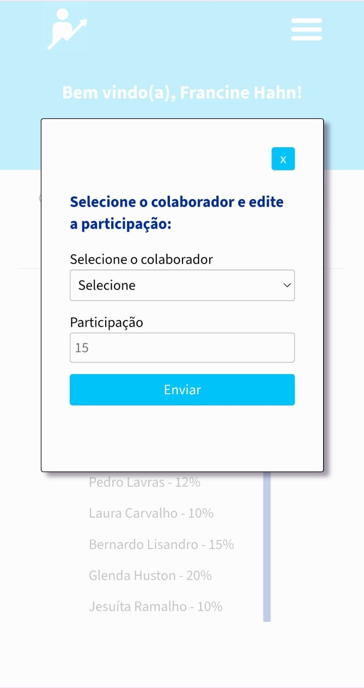
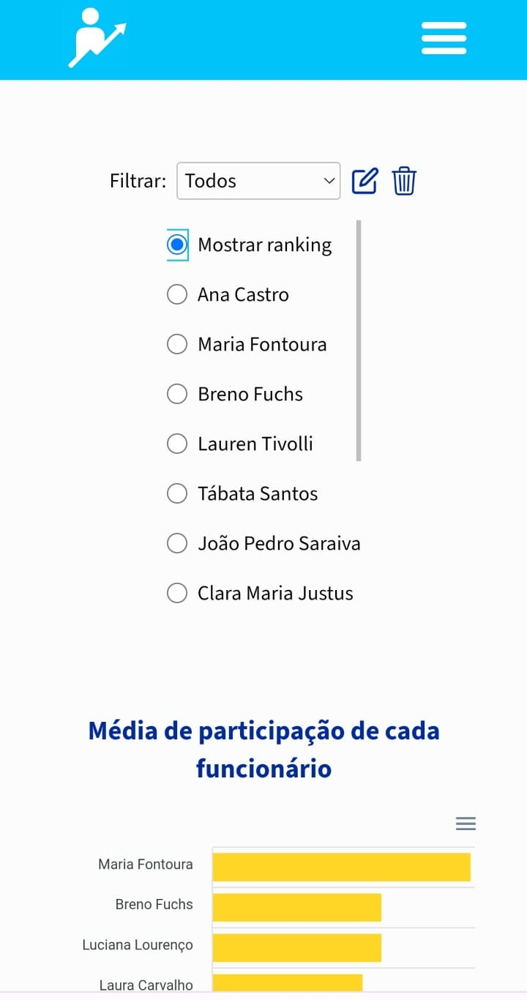
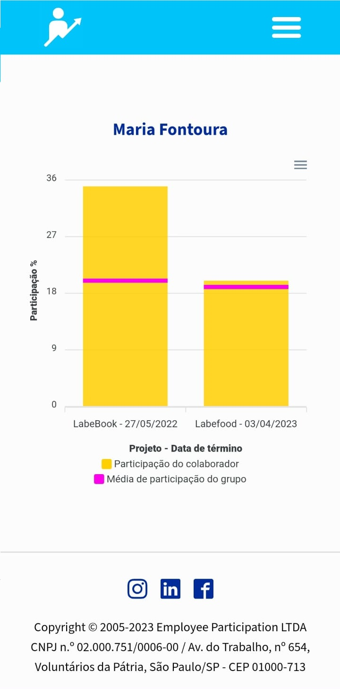
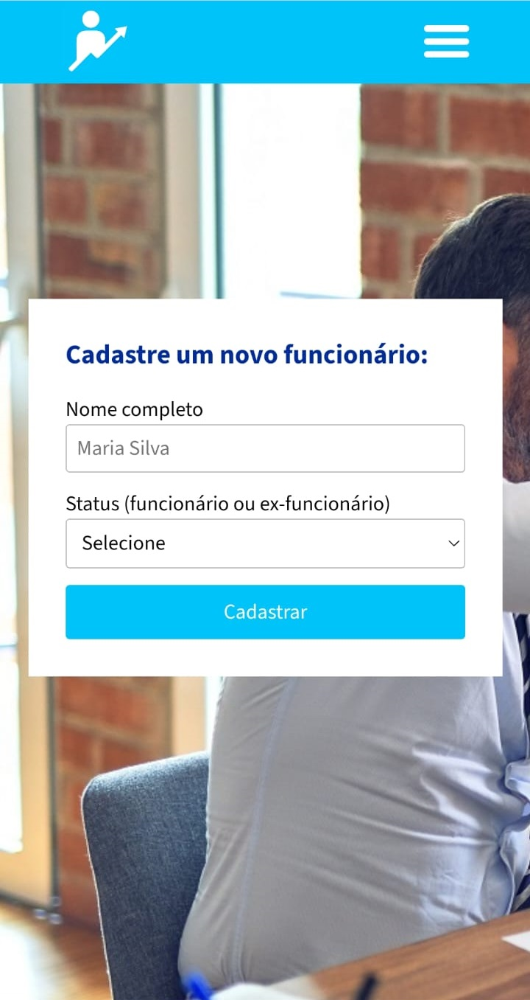

<h1 align="center">Front-end - Employee Participation: Cubo Challenge</h1>

## ℹ️ About
This is a Next.js project that simulates a website where employers can register the participation rate of their employees in each of their projects. Data is represented through the use of common graphs (donut charts and bar charts). 

This website is responsive to all screes sizes.

Data was consumed from an API developed by me. The link of the github repository is: https://github.com/francinehahn/employee-participation-backend

## 🌐 Deploy
https://employee-participation-frontend.vercel.app/

## 👩‍💻 Technologies
- Javascript
- Next.js
- Sass
- Axios
- Apex Charts
- Nookies

## ☑️ Functionalities
- `Login/Signup Page:`
    - Login
    - User registration
    - Input validation
    - Authentication
- `Registration Page:`
    - Input validation
    - Project registration
    - Employee Registration
- `Projects Page:`
    - Data visualization of each registered project
    - Assign new collaborators to a project and their respective participation rate
    - Edit project information
    - Edit the participation rate of a collaborator
    - Delete a project
    - Delete a collaborator from a project
- `Employees Page:`
    - Data visualization of each registered employee
    - Filter employees by their status (active or inactive)
    - Edit employee status
    - Delete an employee

## 📷 Images

 

 

 

 

 

 

 

 

 

 

 

## 🛰 Running the project
<pre>
    <code>git clone https://github.com/francinehahn/employee-participation-frontend.git</code>
</pre>

<pre>
    <code>cd employee-participation-frontend</code>
</pre>

<pre>
  <code>npm install</code>
</pre>

<pre>
  <code>npm run start</code>
</pre>